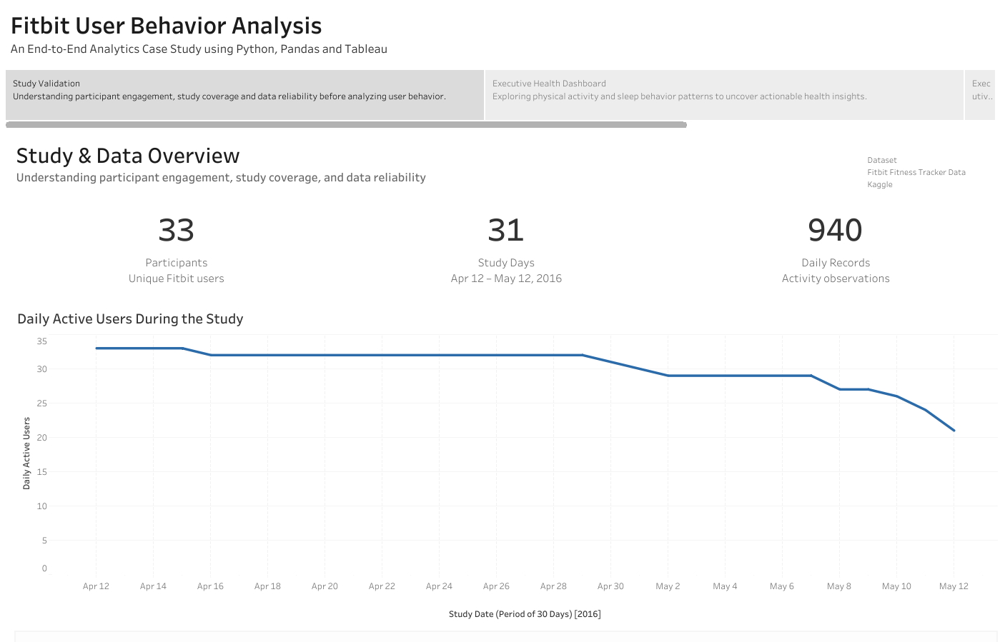
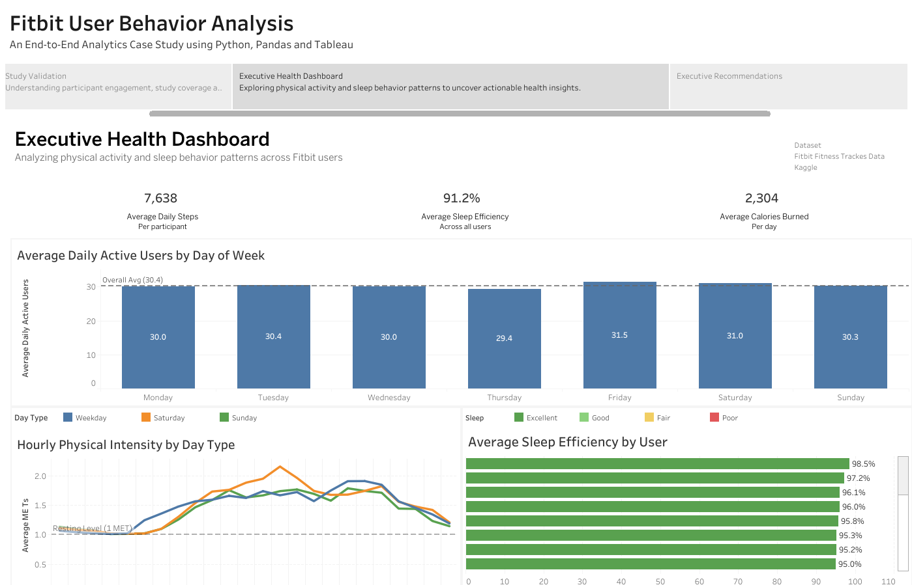
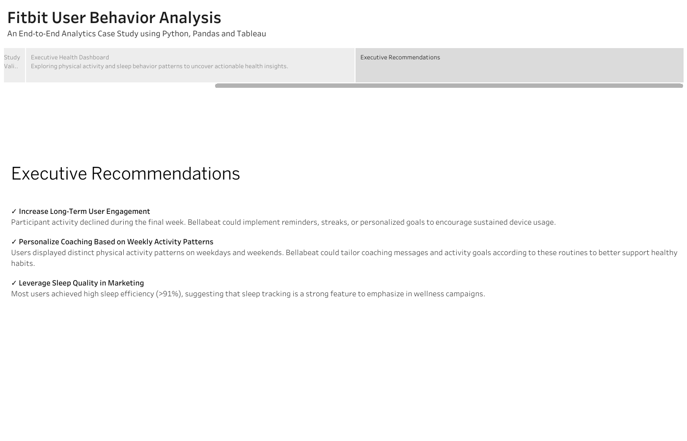

# Fitbit User Behavior Analysis

> End-to-End Data Analytics Case Study using Python, Pandas and Tableau

## 📌 Project Overview

This project analyzes Fitbit user behavior to identify trends in physical activity, sleep quality, and user engagement. The analysis combines Python for data preparation and Tableau for interactive dashboards and storytelling, transforming raw wearable data into actionable business insights.

---

## 🎯 Business Problem

Bellabeat aims to better understand how users interact with fitness trackers to improve customer engagement and promote healthier lifestyles. This project explores participant behavior and provides data-driven recommendations based on activity and sleep patterns.

---

## 🎯 Objectives

- Analyze daily user engagement throughout the study.
- Identify physical activity patterns by weekday and weekend.
- Evaluate sleep efficiency across participants.
- Build interactive dashboards to communicate findings.
- Provide business recommendations supported by data.

---

## 🗂 Dataset

- **Source:** Fitbit Fitness Tracker Data (Kaggle)
- **Study Period:** April 12 – May 12, 2016
- **Participants:** 33 Fitbit users
- Data Source License: Public dataset provided through Kaggle for educational and analytical purposes.

---

## 🛠 Tools & Technologies

- Python
- Pandas
- Jupyter Notebook
- Tableau
- Git
- GitHub

---

## 📊 Dashboards

## 🌐 Interactive Dashboard
Explore the complete interactive dashboard on Tableau Public:
**[View Interactive Dashboard on Tableau Public](https://public.tableau.com/views/Fitbit_User_Behavior_Analysis/FitbitUserBehaviorAnalysis)**

---

## 📊 Dashboard Preview

### Study & Data Overview



---

### Executive Health Dashboard



---

### Executive Recommendations



---

## 🔍 Key Insights

- Participant engagement remained stable during most of the study but declined during the final week.
- Users averaged approximately **7,638 daily steps**.
- Average sleep efficiency reached **91.2%**, indicating generally good sleep quality.
- Physical activity followed distinct weekday and weekend patterns.
- Activity intensity consistently returned to resting levels overnight.

---

## 💡 Business Recommendations

- Increase long-term user engagement through personalized reminders and goals.
- Personalize coaching based on weekday and weekend activity patterns.
- Promote sleep tracking as a key wellness feature.

---

## 📁 Repository Structure

```text
fitbit-user-behavior-analysis/
│
├── data/
│   ├── raw/
│   └── processed/
│
├── notebooks/
│
├── tableau/
│
├── images/
│
└── README.md
```

---

## AI-Assisted Development

This project was developed using large language model (LLM) tools as a learning and productivity tool to support research, improve documentation, refine communication, and validate technical approaches. 
All analysis, implementation, interpretations, and final decisions were reviewed and completed by the author.


## 👤 Author

**Andres Galeas**

Google Data Analytics Professional Certificate

GitHub: https://github.com/AndresDGA